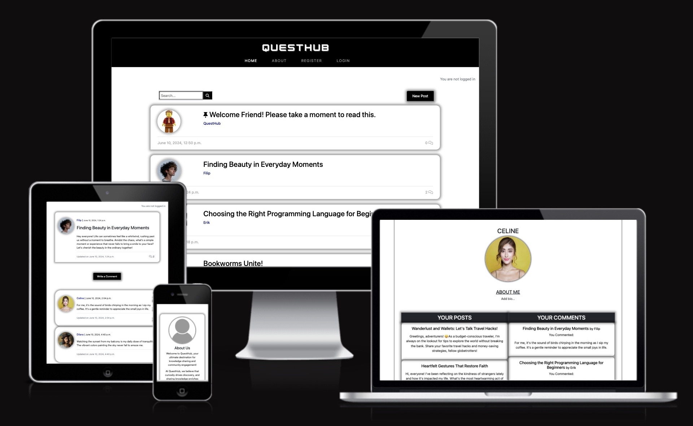
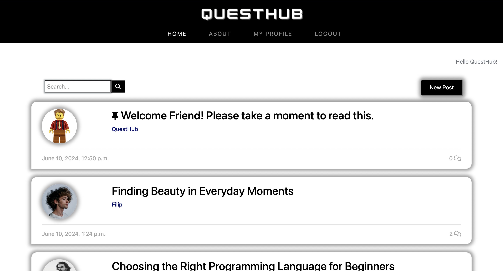
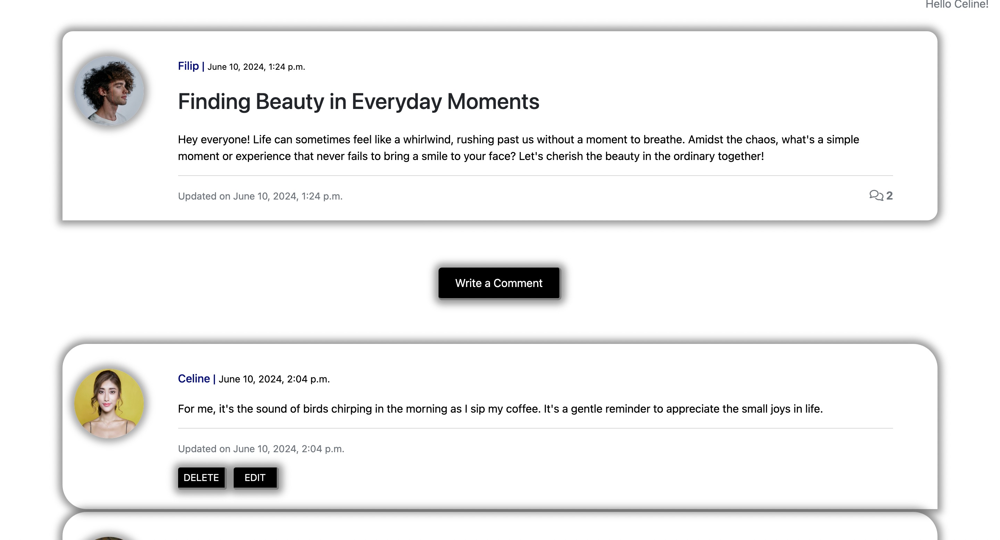
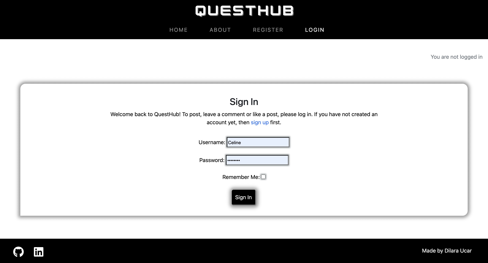
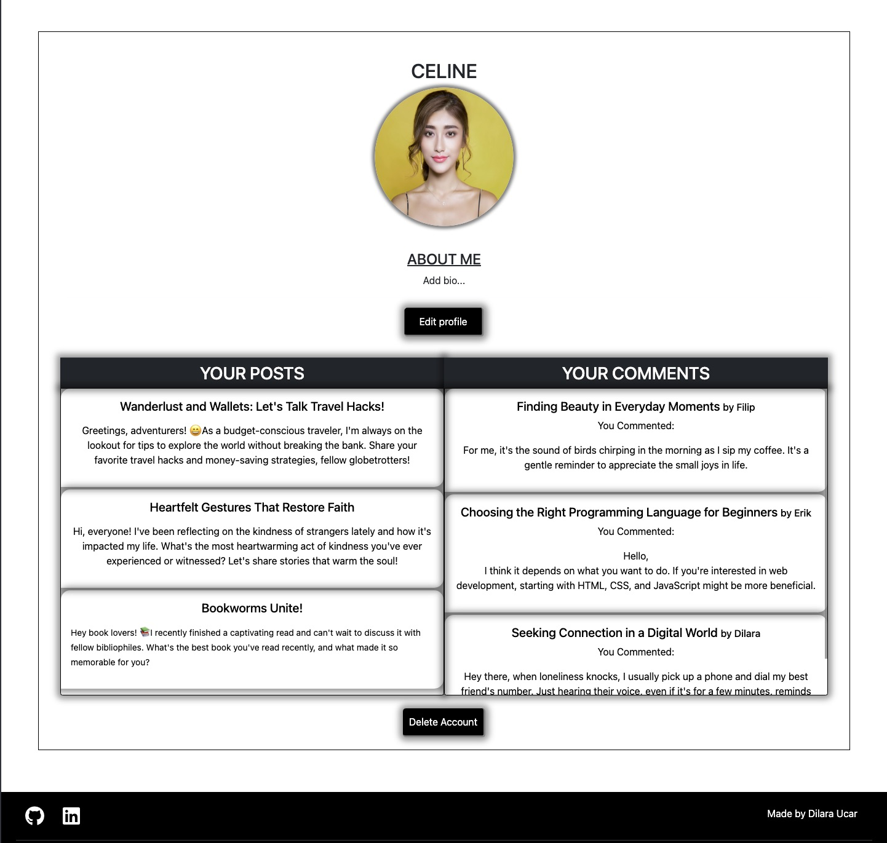
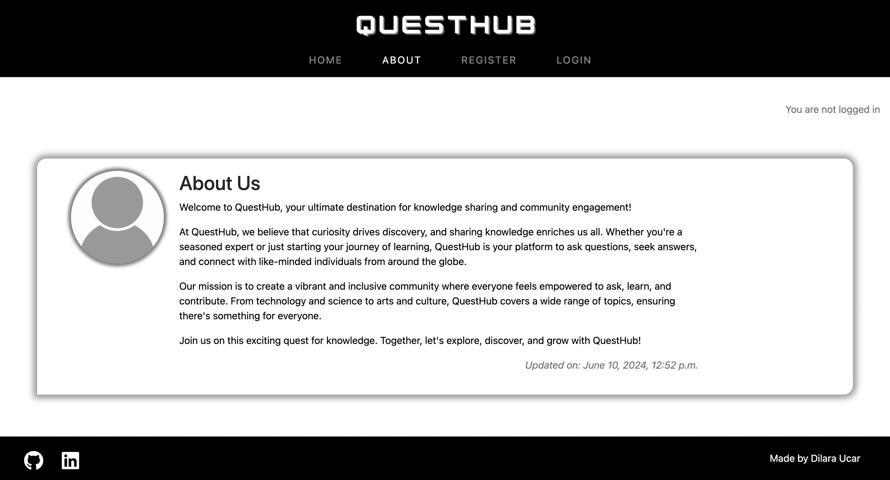

# Welcome to QuestHub!

Welcome to QuestHub, a web application that enables you to share your knowledge, ask questions and find answers! QuestHub empowers you to ask questions, find answers, and connect with like-minded individuals worldwide.

Visit live site: [QuestHub](https://django-portfolio-468596d338f0.herokuapp.com/)

# Table of Contents

## Features

### Existing Features:

#### Home Page:

The home page displays a list of posts with the latest post shown first and a pinned post from the website owner displaying some rules. Each post shows the avatar of the person who has created the post along with information about when the post was created, last update, and how many comments it has. Opening any of the posts opens the corresponding post detail page. 
The search bar lets users filter posts to easily find what they're looking for.

#### Post Detail Page:

When i user opens a post to come to the post detail oage they can see the full contents of the post along with any comments it has.

Under each post theres a button for writing comments which will open up a form only if a user is logged in and if not a message will be displayed for the user to tell them to login or register an account.

The comments are sorted from oldest to newest in order. Under each comment theres a delete and edit button only if a the comment belongs to the logged in user (gives the user full CRUD capabilities), which makes it easy for a user to edit or delete the comments they make in a quick way.

#### Register/Login Page:

The pages for account registration and user login are kept simple and clean and the designs are mostly from django allauth. New users can sign up using a username, email and a password, with all obligatory fields.

#### Profile Page:

On the profile page, an logged in user can write a bio and upload a profile picture if they want. There's also a button for deleting the account that opens up a deletion modal to confirm deletion. Users can also see a list of the posts and comments they have made with each one linking to its origin if opened.

#### About Page:

The About page of QuestHub is a brief description of the goal of the site, inviting everyone to join in the quest for knowledge and growth.

### Future Implementations:
In a potential future iteration:
- I'd like to add private messaging system.

- I'd also add a sorting system to search and post pages.

- A new view to add likes functionalities.

- Update the profile page so users can display there socials in an effective manner to build friendships with others easily.

### Defensive Design Features

## User Experience
### User stories

## Design
### Color Pallete
### Typography
### Imagery
### Wireframes
### Accessibility
### Agile Methodology
### Data Model

## Technologies Used
### Languages Used
### Frameworks & Libraries Used
### Other Technologies Used

## Deployment
### Heroku
### GitHub

## Testing
### Solved Bugs
### Unfixed Bugs

## Credits
### Media
### Tutorials & Code Used

