# WELCOME TO QUESTHUB!

Welcome to QuestHub, a web application that enables you to share your knowledge, ask questions and find answers! QuestHub empowers you to ask questions, find answers, and connect with like-minded individuals worldwide. Questhub was build with Reddit as an inspiration. And the style of the page was done to mimic IOS messaging with the message bubbles.

Visit live site: [QuestHub](https://django-portfolio-468596d338f0.herokuapp.com/)

# Table of Contents
* [Features](#Features)
    * [Home page](#home-page)
    * [Post Detail page](#post-detail-page)
    * [Register/Login Page](#registerlogin-page)
    * [Profile Page](#profile-page)
    * [About Page](#about-page)
    * [Comments & Profile Page](#comments--profile-page)
  * [Future Implementations](#future-implementations)
* [User Experience (UX)](#user-experience-ux)
  * [User Stories](#user-stories)
  * [Agile Methodology](#agile-methodology)
* [Design](#design)
  * [Colour Pallete](#colour-pallete)
  * [Imagery](#imagery)
  * [Wireframes](#wireframes)
  * [Database Schema](#database-schema)
* [Technologies Used](#technologies-used)
  * [Languages Used](#languages-used)
  * [Frameworks, Libraries & Programs Used](#frameworks-libraries--programs)
* [Deployment](#deployment)
  * [Heroku](#heroku)
  * [Cloudinary](#cloudinary)
  * [GitHub](#github)
  * [Local Development](#local-development)
* [Testing & Bugs](#testing--bugs)
* [Credits](#credits)
  * [Code Used](#code-used)
  * [Content](#content)
  * [Media](#media)
  * [Acknowledgments](#acknowledgments)

## FEATURES

#### HOME PAGE:

The home page displays a list of posts with the latest post shown first and a pinned post from the website owner displaying some rules. Each post shows the avatar of the person who has created the post along with information about when the post was created, last update, and how many comments it has. Opening any of the posts opens the corresponding post detail page. 

The search bar lets users filter posts to easily find what they're looking for and if no search is found the user is notified with a small text and to please try again.

The 'New Post' button will open up a form for the user to write a heading and some content. This form is only opened if the user is logged in. If not they will get a message telling them to log in or register to continue.

#### POST DETAIL PAGE:

When i user opens a post to come to the post detail page they can see the full contents of the post along with any comments it has.

Under each post theres a button for writing comments which will open up a form only if a user is logged in, and if not a message will be displayed for the user to tell them to login or register an account.

The comments are sorted from oldest to newest in order. Under each comment theres a delete and edit button thats only displayed if a the comment belongs to the logged in user (giving the user full CRUD capabilities), which makes it easy for a user to edit or delete their comments in a quick way.

#### REGISTRATION / LOGIN PAGE:

The pages for account registration and user login are kept simple and clean and the designs are mostly from django allauth. New users can sign up using a username, email and a password, with all obligatory fields. User is also displayed with some 'rules' for passwords and also will get a small notification from the form in red text if the password or other fields does not pass and what improvements they can do. All this allows each user to get a more secure login.

#### PROFILE PAGE:

On the profile page, an logged in user can write a bio and upload a profile picture if they want. The upload a image field has some restrictions for overall web functionality. The user can only upload image files, so be it png, jpeg, etc as long as its an image file they will be able to upload that image. If the image does not meet the requirements and the user tries to upload the image they will get a displayed message that te file there trying to upload is not an image file and will give them all file formats that are allowed. Likewise if the user updates there profile successfully they will get a success message of there action.

Image of displayed error message

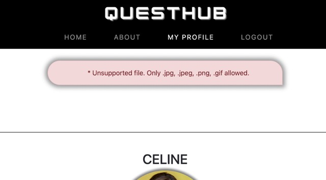

 

There's also a button for deleting the account that opens up a deletion modal to confirm deletion. Users can also see a list of the posts and comments they have made, if any, with each one linking to its origin if opened to read the post or comment. All profile pages are open to the public and all users can see there bio, avatar, and post/comments the user have made.

#### ABOUT PAGE:

The About page of QuestHub is a brief description of the goal of the site, inviting everyone to join in the quest for knowledge and growth.

#### COMMENTS & PROFILE PAGE:
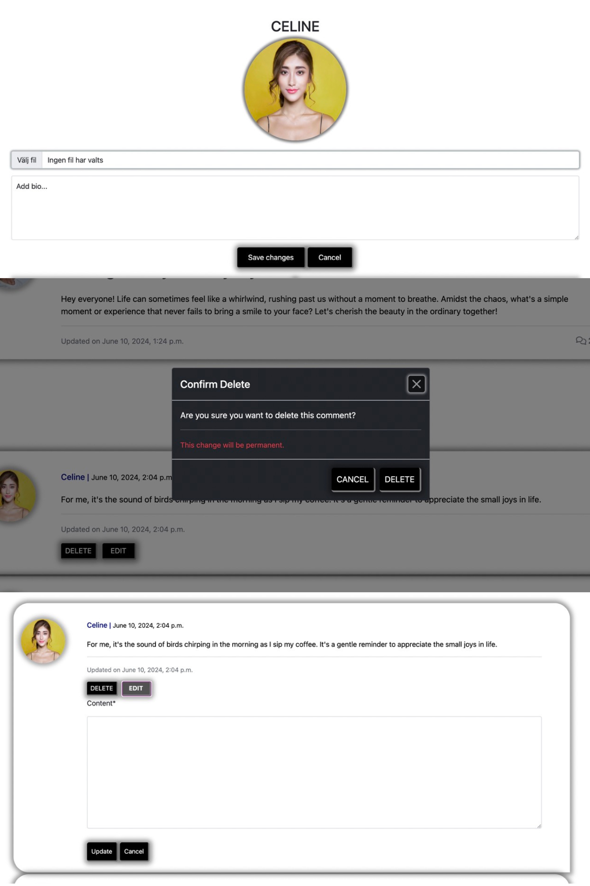

In the profile page I've added delete functionalities along with updating and adding a biography and user avatars.

On the post detail page when the user is logged in and have written a comment they get the options to edit or delete there comments as shown in the pictures above.

The edit button opens up a seperate form with the content of the comment prefilled so the user can efficiently update their comment.

The delete modal looks the same for both pages.

### FUTURE IMPLEMENTATIONS:
In a potential future iteration:
- I'd like to add private messaging system.

- I'd also add a sorting system to search and post pages.

- A new view to add likes functionalities.

- Update the profile page so users can display their socials in an effective manner to build friendships with others on the site.

- I'd add crud functionalities for posts.

## USER EXPERIENCE (UX)
### USER STORIES
|                                       ||                                                                                   |
| :-------------------------------------|--|:------------------------------------------------------------------------------------------- |
|**USER REGISTRATION**             |  ||
|                                       |  | As a user, I want to be able to register on the website|             
|                                       |  | Then the user can log in.|
|                                       |  | When the user is logged in they can comment on any post they want.|
|**POST/OPEN THREADS**   |  || 
|                                       |  | When a blog post title is clicked on a detailed view of the post is seen.|
|                                       |  | Given a logged in user, they can create a post.|
|                                       |  | Given a logged in user, they can read a post.|
|**MANAGE COMMENTS**                            |  ||
|                                       |  | Given a logged in user, they can comment on a post.|
|                                       |  | Given a logged in user, they can read a comment|
|                                       |  | Given a logged in user, they can update a comment they have made.|
|                                       |  | Given a logged in user, they can delete a comment they have made.|
|**USER PROFILES**                               |  ||
|                                       || As a logged in user, I get an automatic profile page when new account is registered.|
|                                       || As a site user, I can view the profile page for my account and others.|                                  
|                                       || As a site user, I can see my posts, comments and profile picture on my profile page.|
|**EDIT / DELETE PROFILE**                       |  ||
|                                       || As a logged in user, I can upload a profile picture.|
|                                       || As a logged in user, I can write a profile bio and update it.|
|                                       || As a logged in user, I can delete my own profile.|
|**POST PAGINATION**              |  ||
|                                       || Given more than one post in the database, these multiple posts are listed.|
|                                       || When a user opens the main page a list of posts is seen.|
|                                       || Then the user sees all post titles with pagination to choose what to read.|
---

### AGILE METHODOLOGY

I used GitHub projects to manage this project's development stages using Agile methodology. You can see my iterations and project board to learn more.

 I added all the user stories to the Issues page and connected them to the project board. I kept iterations short and somewhat flexible. Each user story has a list of acceptance criteria and associated tasks, each one with a checkbox for easy tracking of progress.

 During the making of the project i decided some of the user stories was not as important to focus on during the scope of time to finsih the project and decited not to do them. I also created an excel sheet to more easily update and rewrite user stories. A user story i added that is not seen on the project board is the full CRUD functionality for comments. I also added a user stories for profiles so that i could easily keep track of what i wanted the functionalities to be.

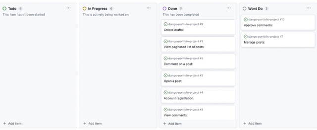

## DESIGN

The designing of this project Reddit was used as an inspration. I wanted the posts and comments to mimic the design of IOS messaging with the posts and comments having round edges with one side 'pointy' like messages on Iphones.

### COLOUR PALETTE

I decided to keep the color pallete very clean and stick with black and white. The only 'color' to the page would be user avatar images.

### TYPOGROPHY

For this site, I kept it simple with a clean sans-serif font across the whole site.

### IMAGERY

The site uses no imagery of its own and instead leaves the whole image space for users profile pictures.

### WIREFRAMES

Before building the site, I made wireframes for all the main sites. When building the site i made some changes on the pages such as the layout on tablet screens to fit the design better.

**HOME WIREFRAMES:**

Desktop

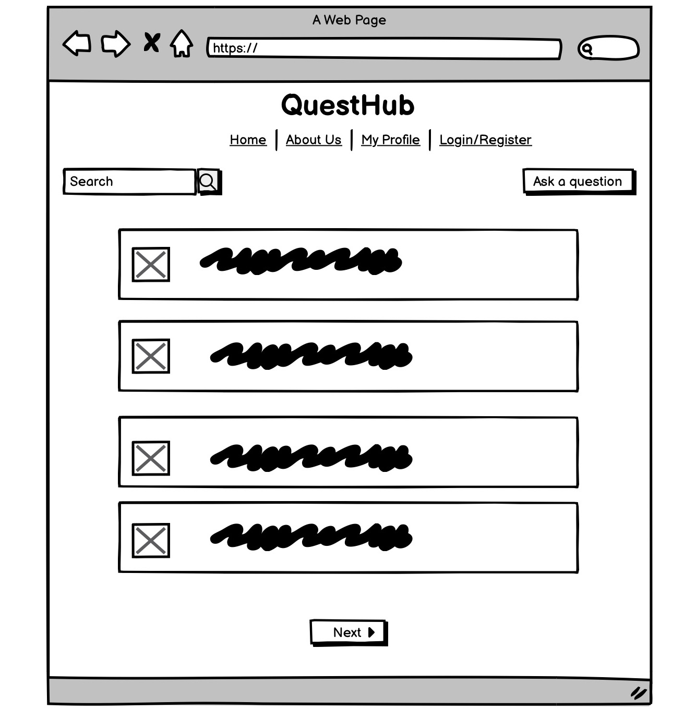

Tablet

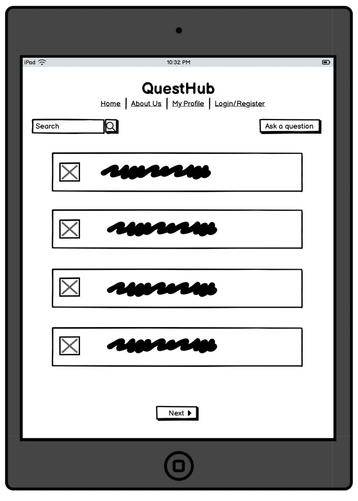

Phone

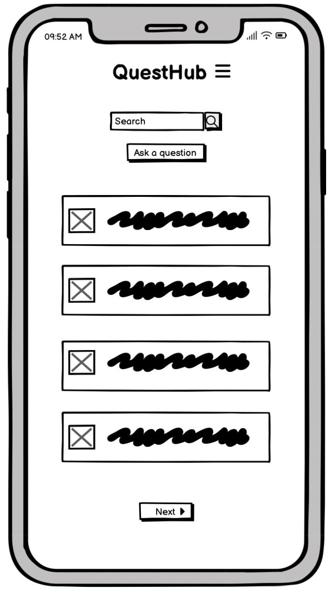

---
**POST DETAIL WIREFRAME:**

Desktop

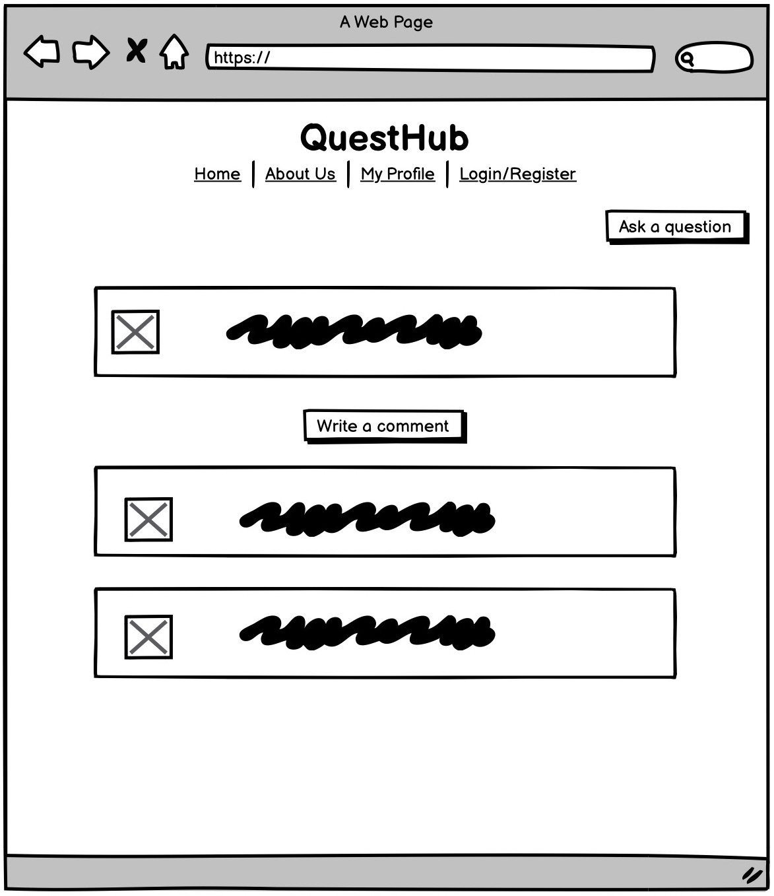

Tablet

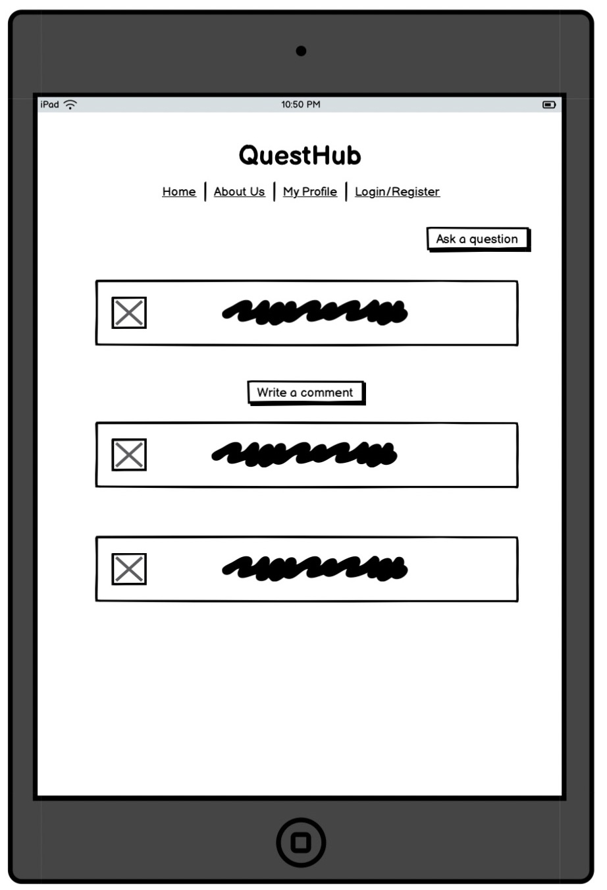

Phone

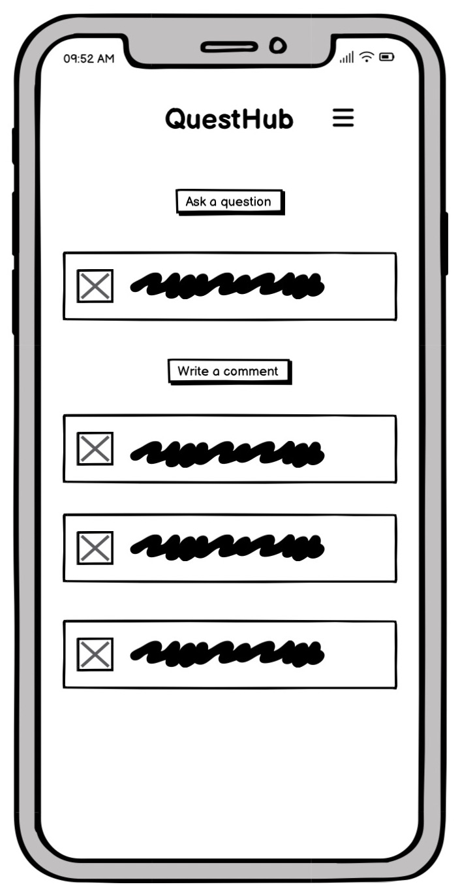

---
**PROFILE WIREFRAME:**

Desktop

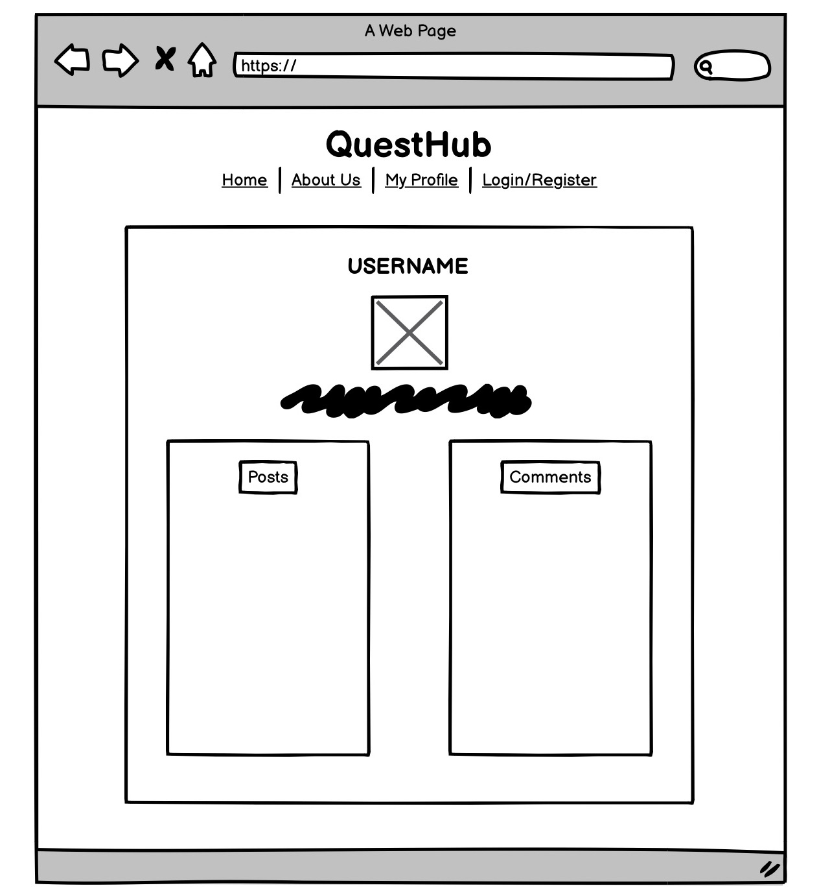

Tablet

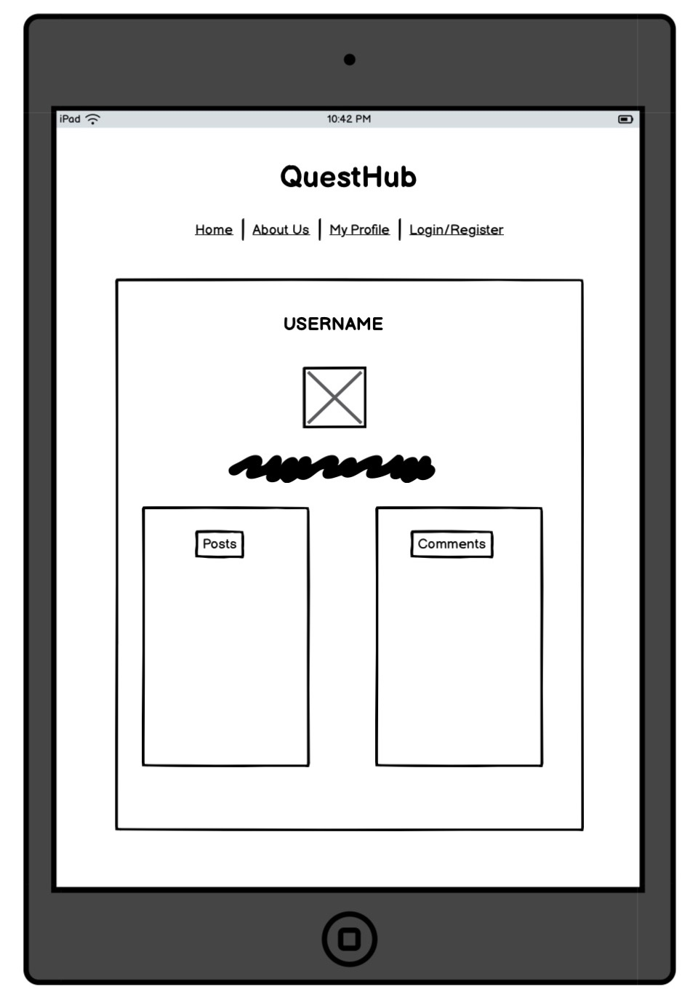

Phone

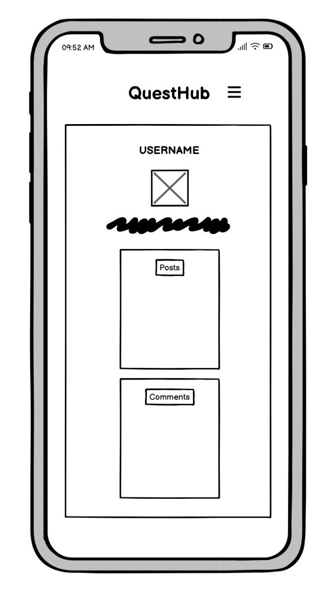

### DATABASE SCHEMA

The database schema shows the structure of the database, the type and their relationship. This schema was done using [Lucid Chart](https://www.lucidchart.com/).

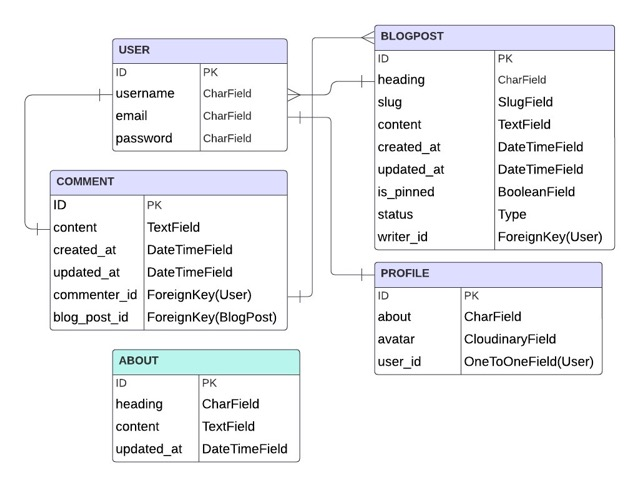

##  TECHNOLOGIES USED

### LANGUAGES USED 

Python, HTML, CSS, and JavaScript.

### FRAMEWORKS, LIBRARIES & PROGRAMS

[DJANGO](https://www.djangoproject.com/) - The main web framework, used for database handling and templates.

[BOOTSTRAP](https://getbootstrap.com/) - Used for more efficient styling and scripting.

[SUMMERNOTE](https://github.com/summernote/summernote) - Used for more efficient styling and scripting.

[FONTAWESOME](https://fontawesome.com/icons
) - Supplies the icons used across the site.

[CI TEMPLATE](https://github.com/Code-Institute-Org/gitpod-full-template) - To run the project using Heroku.

[LUCID CHARTS](https://www.lucidchart.com/pages/) - Used to create ERD design.

[AMIRESPONSIVE](https://ui.dev/amiresponsive) - To generate a mockup in different screen sizes.

[CLOUDINARY](https://cloudinary.com/) - For storing static data

[HEROKU](https://id.heroku.com/) - To deploy the App.

[CANVA](https://www.canva.com/) - To create a logo.

[BALSAMIQ](https://balsamiq.com/) - To create wireframes for project.

[FAVICON](https://favicon.io/favicon-generator/
) - To create a favicon.

[GIT](https://git-scm.com/) - For version control.

[GITHUB](https://github.com/) - To save and store the files for the website.

## DEPLOYMENT

- This site was deployed by completing the following steps:

***Requirements and Procfile before Deployment:***

In order to deploy the project, Heroku needs information about the technologies used. Before deployment, I createD a Procfile and a list of requirements. In some cases, you may also need a runtime.txt file specifying the version of Python to use.

- Create a plain file called Procfile, at the root level of the project.
- Type web: gunicorn my_project.wsgi into the Procfile and save.
- In your IDE terminal, type pip3 freeze local > requirements.txt to create the requirements.
- (Optional) Create a runtime.txt and type python-3.2(or whichever version you use).
- Commit and push these files to the project repository.
- In order to protect the django app secret key it was set as environment variable and stored in env.py file.

### HEROKU
1. Log in to [Heroku](https://id.heroku.com) or create an account
2. Click “New”
3. Click “Create new app”
4. Give your app a name and select the region closest to you. When you’re done, click “Create app” to confirm
5. Open the Settings tab and add the config vars

#### CLOUDINARY
1. Log in to [Cloudinary](https://cloudinary.com/) or create an account.
2. Navigate to dashboard/console https://console.cloudinary.com/console/ and copy API Enviroment variable starting with "cloudinary://".
3. Paste copied url into env.py file as CLOUDINARY_URL value and save the file.

 

**Heroku Settings:**

For Heroku to be able to process and render the project, you must define some environment variables. Deploying the project without these is like trying to start a car without the key.

1. Go to the settings page of your new app you created.
2. Scroll down and open the Config Vars.
3. Add a DATABASE_URL variable and assign it a link to your database.
4. Add a SECRET_KEY variable and assign it a secret key of your choice, you can use a secret key generator for this (should be different than the one in project env file).
5. Add a CLOUDINARY_URL variable and assign it a link to your Cloudinary.

 

**Project Settings:**

Important that the environment variables and settings in the django project are compatible with the settings on heroku. These are the steps to ensure a proper setup for working deployment:

- Include https://<your_app_name>.herokuapp.com in the ALLOWED_HOSTS and CSRF_TRUSTED_ORIGINS lists inside the settings.py file.
- Make sure that the environment variables (DATABASE_URL, SECRET_KEY, and CLOUDINARY_URL) are correctly set to os.environ.get("<variable_name>").
- If making changes to static files or apps, make sure to run collectstatic or migrate as needed.
- Commit and push to the repository.

 

**Deploy the project to Heroku:**
Once your Heroku settings and GitHub repository are up to date, it's time to connect the two and deploy the project:

- Go to the Deploy tab of your Heroku app.
- Scroll down and find "Deployment method" section and click GitHub.
- Type in the name of your repository to search and click 'Connect' to connect the repository.
- (Optional) Enable automatic deployment to automatically update the Heroku app whenever you push to GitHub.
- Click "Deploy branch" main.
- Wait for Heroku to finish building the app.
- Upon successful deployment, click the "View" button to open the deployed app.

### GITHUB

### Local Development

***How to Fork Repository:***

1. Log in to GitHub.
2. Go to the repository for this project, [DilaraUcar/django-portfolio-project](https://github.com/DilaraUcar/django-portfolio-project).
3. Click the Fork button in the top right corner.

***How to Clone the Repository:***

1. Log in to GitHub.
2. Go to the repository for this project, [DilaraUcar/django-portfolio-project](https://github.com/DilaraUcar/django-portfolio-project).
3. Click code button, select if you would like to clone with HTTPS, SSH or GitHub CLI and copy the link shown.
4. Open the terminal in your code editor and change the current working directory to the location you want to use for the cloned directory.
5. Type 'git clone' into the terminal and then paste the link you copied in step 3, then press enter.

## TESTING & BUGS

Please refer to [TESTING.md](TESTING.md) file for all testing and bug handling carried out.

## CREDITS

### CODE USED

- i used this website to write my base model: [StackOverflow](https://stackoverflow.com/questions/67754127/are-django-abstract-models-really-that-useful)

- [Code Institue](https://learn.codeinstitute.net/ci_program/diplomainsoftwaredevelopmentecomm) walkthought tutorials "Hello Django" & "I think therefore I blog".

- [Stack overflow](https://stackoverflow.com/) helped me to troubleshoot many of the issues encountered.

- I also researched on [W3 Schools](https://www.w3schools.com/) & [Django Documentation](https://docs.djangoproject.com/en/4.2/).

- Code Institutes tutors Sarah & Thomas helped me with some bootstrap and javascript code that was not working. More on specificities in my [TESTING.md](TESTING.md) file on the exact issue and code used.

- [Code Institue](https://learn.codeinstitute.net/ci_program/diplomainsoftwaredevelopmentecomm) walkthought tutorials "Boutique Ado" for the search input code in base template.

- For pinned posts in models i used code from [Stack overflow](https://stackoverflow.com/questions/66570706/how-to-pin-posts-in-django). This page explaines how to implement pinning posts and the changes that needs to be made to achieve this.

- [CI Blog Walkthrough](https://github.com/Code-Institute-Solutions/blog) has been used for comment deletion code.

### CONTENT

- [ChatGPT](https://chatgpt.com/c/76cf6692-96c0-4914-929d-a49711709d4d) for quickly generating some questions and answers for my projects posts and comments.

- [Reddit](https://www.reddit.com/) was used as inspiration in the process of building this project.

### MEDIA

- [Pexels](https://www.pexels.com/) was used for profile avatar images for all users on project.

### ACKNOWLEDGEMENTS

- Thank You to Spencer Barriball, my Code Institute Mentor.
- Thank you to Tutor support at Code Institute and the Slack community.
