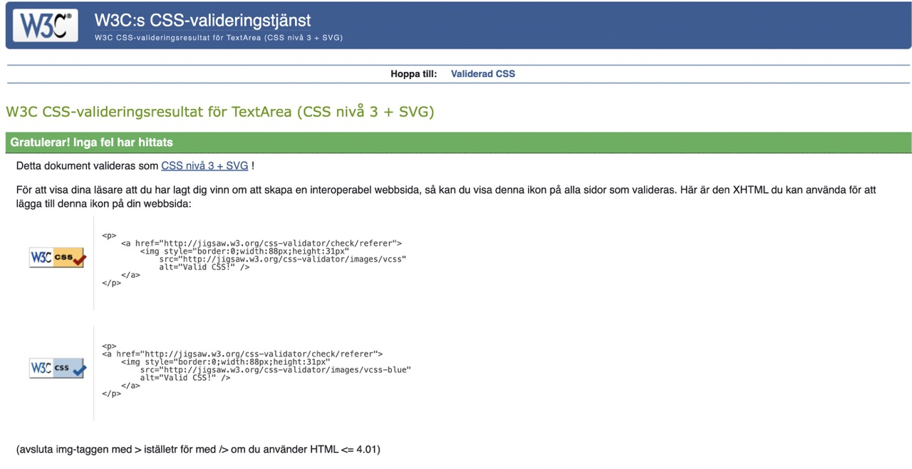

# QUESTHUB TESTING & BUGS

Welcome to QuestHub, a web application that enables you to share your knowledge, ask questions and find answers! QuestHub empowers you to ask questions, find answers, and connect with like-minded individuals worldwide. Questhub was build with Reddit as an inspiration. And the style of the page was done to mimic IOS messaging with the message bubbles.

Visit live site: [QuestHub](https://django-portfolio-468596d338f0.herokuapp.com/)

# Table of Contents
* [User Story Testing](#user-story-testing)
  * [USER REGISTRATION	](#user-registration)
  * [POST/OPEN THREADS](#postopen-threads)
  * [MANAGE COMMENTS](#manage-comments)
  * [USER PROFILES](#user-profiles)
  * [EDIT / DELETE PROFILE](#edit--delete-profile)
  * [POST PAGINATION](#post-pagination)
* [AUTOMATED TESTING](#automated-testing)
  * [Python Linter](#python-linter)
  * [Lighthouse Scores](#lighthouse-scores)
    * [Home](#home-score)
    * [Post Detail](#post-detail-score)
    * [Profile](#profile-score)
  * [Jigsaw CSS Validator](#jigsaw-css-validator)
  * [W3 Html Validator](#w3-html-validator)
  * [JSHint Validator](#jshint-validator)
  * [Custom Automated Testing](#custom-automated-testing)
* [Manual Testing](#manual-testing)
  * [Full Testing](#full-testing)
* [BUG TRACKER](#bug-tracker)
  * [Solved Bugs](#solved-bugs)
  * [Unfixed Bugs](#unfixed-bugs)

 

[< Back to README](README.md)

## USER STORY TESTING

### USER REGISTRATION	

| Goals | How are they achieved? |
| --- | --- |
| As a user, I want to be able to register on the website | Any user that wants to register can simply go to signup page and register as long as a username, email and a password is entered in correct formats, as stated on the registation page. |
| Then the user can log in.| The users are automatically logged in when account is registered and if they logout they can login again with no issues.
 | When the user is logged in they can comment on any post they want.| Yes when user is logged in they will be redirected to home page which will have the button for writing a post in the upper right corner. If they want to comment on any posts they can do so by opening any post and then they will see the 'write a comment' button which will open up a form.|
 | |

### POST/OPEN THREADS		

| Goals | How are they achieved? |
| --- | --- |
| When a blog post title is clicked a detailed view of the post is seen. | When a post is opened the user will be able to see the contents of the post and all its comments.|
| Given a logged in user, they can create a post. | All logged in users can create posts by clicking the new post button on the home page. |
| Given a logged in user, they can read a post.| Yes all logged in users can read all posts that are published. |

### MANAGE COMMENTS	

| Goals | How are they achieved? |
| --- | --- |
| Given a logged in user, they can comment on a post.| All logged in users can comment on a post of their choice by opening the post they want to comment on and then pressing the 'write a comment' button that will open up a form for them to write a comment in.|
| Given a logged in user, they can read a comment | Logged in users can read all comments by navigating to a post they want to read and seeing all comments that have been written underneath the post. |
| Given a logged in user, they can update a comment they have made. | All users that are logged in with the account they have made a comment with to a post can edit and update the existing comment by pressing the edit button underneath their comment which will open up a form thats prefilled with the content of there comment. |
| Given a logged in user, they can delete a comment they have made. | All users that are logged in can delete their account by going to 'My Profile' and then scroll down to the 'Delete Account' button. By clicking on this button a confirmation modal to confirm the deletion will open up.|

###  USER PROFILES		

| Goals | How are they achieved? |
| --- | --- |
| As a logged in user, I get an automatic profile page when new account is registered. | By creating a account the user will automatically get their own profile, which they can access in the navigation menu by going to 'My Profile'. |
| As a site user, I can view the profile page for my account and others. | All profiles can be accessed, either by going to own profile by going to nav menu and clicking on 'My Profile', or by clicking on username or avatar if a post has been made which will take them to their own profile or other peoples profile if they have pressed on another persons posts username or avatar that is not their own. |
| As a site user, I can see my posts, comments and profile picture on my profile page. | On My Profile page all comments and posts, if any, will be displayed with clickable links to the posts they have made or the post where there comment has been written. By clicking on the posts or comments on my profile it will take the user to that specific post or comment. If no comments or posts has been made by a user there will instead be a small texts that states that the user has no posts and/or no comments. |

###  EDIT / DELETE PROFILE			

| Goals | How are they achieved? |
| --- | --- |
| As a logged in user, I can upload a profile picture. | Logged in users can change their avatars by heading to their profile page thats present in the top nav menu. If they then press the 'Edit Profile' button on the profile page they will be able to change there profile picture. |
| As a logged in user, I can write a profile bio and update it. | Logged in users can write a profile bio by heading to their profile page thats present in the top nav menu. If they then press the 'Edit Profile' button on there profile page a form will be opened in which they can write a bio in, and then pressing the 'save changes' button will update the profile to display their edited bio. |
| As a logged in user, I can delete my own profile. | In there profile page the user can delete their profile by pressing the delete account button at the bottom of page, which then opens up an confirmation bootstrap modal to confirm the deletion of their account. |

###  POST PAGINATION				

| Goals | How are they achieved? |
| --- | --- |
| Given more than one post in the database, these multiple posts are listed. | All posts are listed on the website. |
| When a user opens the main page a list of posts is seen. | When user goes to main page of website the post are seen in a list format with the newest post appearing first after the pinned post. |
| Then the user sees all post titles with pagination to choose what to read. | All post titles are present so that the user may choose to read a post that interests them. If more than 5 posts are present in database pagination buttons will appear at the end of the five posts that indicates that there are more posts to be seen on second page. And if the user presses the next button they will come to this second page and there will be displayed a 'prev' button to go back to main post page. |

---

## AUTOMATED TESTING

### PYTHON LINTER

I used [Python Linter - Pep8CI](https://pep8ci.herokuapp.com/) to test python code, all errors were fixed which were mostly related to spacing, code line length or whitespacing in code.

### LIGHTHOUSE SCORES

I used Lighthouse in Chrome Developer Tools in incognito mode to test the performance, accessibility, best practices and SEO of the website.

In the lighthouse scores at first I did not get the scores i wanted which can be seen in this screenshot:

The biggest issue seemed to be coming from clousinary.
The lower score is partly related to the use of http instead of https on the cloudinary images combined with the size of the images. I looked in Slack and found that other students also have had these issues with cloudinary and they had fixed this issue by adding this code to their settings.py file:

Adding this fixed the issue and all my lighthouse scores was in the green now:

##### HOME SCORE

##### POST DETAIL SCORE

  

##### PROFILE SCORE

  

---

### JIGSAW CSS VALIDATOR

I used [Jigsaw CSS Validator](https://jigsaw.w3.org/css-validator/validator) to test styles.css and found no issues as seen in this screenshot:

---

### W3 HTML VALIDATOR

I used [W3 Html Validator](https://validator.w3.org/) to test all html pages and found no issues as can be seen in this screenshot:

---

###  JSHint VALIDATOR

I used [JSHint Validator](https://jshint.com/) to test all JavaScript files and most issues where missing semicolons which where fixed until no issues found as can be seen in this screenshot:

---

### CUSTOM AUTOMATED TESTING

In addition to the various validators, I created my own tests to test my python code.
Using Django's testing features, I created 16 tests in total for the various views and forms used across the apps that make up the project. I then used these tests to iron out bugs and oversights. All tests now pass consistently.

These tests work by setting up a testing environment and creating mock data to test the functions and features of the project. This lets me do rapid and repeated tests without manual input. And since it's done in a virtual testing environment that is destroyed after each test is run, I don't have to clean out junk data from the database after testing which makes the testing very efficient and clean.

## MANUAL TESTING

Manual testing was carried out as soon as the project started using exploratory testing techniques and a list of bugs was identified and placed in a document to tackle.

At the same time as building the application, it was tested before moving to other steps and checking to make sure no major issues were found. What helped me with tackling the errors and code not working the use of console.log and print statements was extensively used for debugging purposes.

Afterwards, formal test cases were developed and executed.

At a later stage Automated testing was carried out using validators and all errors were fixed, it was checked that all user goals are met and after this, a test table was created.

### FULL TESTING

Comprehensive testing has been conducted to ensure that all website functionalities are working as intended, providing users with a reliable and enjoyable browsing experience.

Full testing was performed on the following devices:

- Laptop:
  - Macbook air 2020 model
- Tablet:
  - iPad Air.
- Mobile:
  - Iphone 11

Each device tested the site using the following browsers:
- Google Chrome
- Safari
- Firefox

## BUG TRACKER

During development, I came across multitude of bugs. With some debugging, and help from tutors and Slack community, I got to the root of each issue and corrected its behavior.

### SOLVED BUGS

**Issue: Incorrect or Missing Avatar Images for New Users**

***Problem Description:***

Previously, avatar images were not loading correctly or were missing entirely for new users on the profile page. This issue was due to the image logic implementation, which required refinement to ensure proper display of user images.

**Solution:**

To resolve the issue, the following changes were implemented:

- The image logic for displaying user avatars was updated based on insights gained from a Code Institute (CI) [blog walkthrough project](https://github.com/Code-Institute-Solutions/blog/blob/main/15_testing/blog/templates/blog/post_detail.html) for image fields. This involved adopting a standardized approach to handle image rendering across different templates **('index.html', 'post_detail.html', 'profile.html')**.

Code Before bug fix

Code used for bug fix

---

**Issue: Bootstrap Deletion Modal Behavior**

***Problem Description:***

There was a bug with the Bootstrap deletion modal on the profile page. When the modal was opened, the cancel and close (x) buttons were not functioning properly. Additionally, the modal backdrop elements remained visible on the page after the modal was closed, causing visual issues.

**Solution:**

To resolve this issue, the following changes were implemented:

- Code was added to the end of the profile.js file to address the malfunctioning cancel and close (x) buttons, ensuring they function correctly and properly hide the modal backdrop after closing.

Code Used to fix Bug

 

**Issue: Freezing Behavior After Modal Interaction**

***Problem Description:***

After fixing the Bootstrap deletion modal's cancel and close (x) button issues, another problem arose where the page would freeze after interacting with the modal. This freeze persisted even after resolving the backdrop issue.

**Solution:**

To resolve the freezing issue, the following change was made:

- A line of code was added to the existing script to reload the page (location.reload()) when either the close (x) or cancel button is clicked in the deletion modal. This action ensures that any lingering freezing issues are mitigated by refreshing the page state.

**Collaborator Assistance:**

The fixes and enhancements were implemented with guidance and support from CI tutors Sarah and Thomas, who provided expert assistance in troubleshooting and resolving the modal behavior issues.

---

**Issue: Unnecessary Validation Error Triggered for Avatar Field**

***Problem Description:***

When updating a user profile using the **'ProfileForm'**, validation errors for the **'avatar'** field were triggered even when only the **'about'** field was updated. This behavior occurred because the **'clean_avatar()'** method in **'forms.py'** unconditionally validated the **'avatar'** field whenever the form was submitted, regardless of whether the **'avatar'** was actually updated.

**Solution:**

To address this issue, the following changes were made:

- Modified the **'clean_avatar()'** method to check if the avatar field has changed compared to its initial instance before performing validation. If the **'avatar'** field remains unchanged, validation for file extension and type is skipped.

- This ensures that validation errors are only triggered when the user updates the **'avatar'** field, improving user experience by preventing unnecessary error messages.

Code Used to fix Bug

Visual Before bug fix

Visual After bug fix

---

**Issue: Incorrect Deletion of Comments**

***Problem Description:***

When deleting a comment from a user with multiple comments resulted in the deletion of the wrong comment. Specifically, when attempting to delete a comment with a specific ID (e.g., ID 4), the comment with ID 1 was deleted instead. The specific problem was related to inconsistencies in how the application handled comment IDs during deletion operations. Although the exact origin of the issue was unclear, it was evident that the existing code did not accurately manage comment IDs during deletion.

**Solution:**

- To address the issue effectively, the solution involved adopting a more reliable approach from the Code Institute's blog [walkthrough project](https://github.com/Code-Institute-Solutions/blog). This approach provided a structured methodology to handle comment deletion based on comment IDs across multiple components of the application.

### UN-FIXED BUGS

No unsolved bugs.

 

[< Back to README](README.md)
