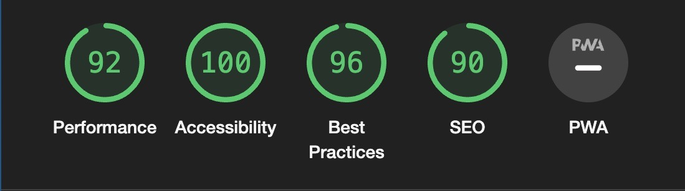

# QUESTHUB TESTING & BUGS

Welcome to QuestHub, a web application that enables you to share your knowledge, ask questions and find answers! QuestHub empowers you to ask questions, find answers, and connect with like-minded individuals worldwide. Questhub was build with Reddit as an inspiration. And the style of the page was done to mimic IOS messaging with the message bubbles.

Visit live site: [QuestHub](https://django-portfolio-468596d338f0.herokuapp.com/)

# Table of Contents
* [User Story Testing](#user-story-testing)
  * [USER REGISTRATION	](#user-registration)
  * [POST/OPEN THREADS](#postopen-threads)
  * [MANAGE COMMENTS](#manage-comments)
  * [USER PROFILES](#user-profiles)
  * [EDIT / DELETE PROFILE](#edit--delete-profile)
  * [POST PAGINATION](#post-pagination)
* [AUTOMATED TESTING](#automated-testing)
  * [Python Linter](#python-linter)
  * [Lighthouse](#lighthouse)
    * [Home](#home)
    * [Post Detail](#post-detail)
    * [Profile](#profile)
  * [Jigsaw CSS Validator](#jigsaw-css-validator)
  * [W3 Html Validator](#w3-html-validator)
  * [JSHint Validator](#jshint-validator)
  * [Custom Automated Testing](#custom-automated-testing)
* [Manual Testing](#manual-testing)
  * [Full Testing](#full-testing)
* [BUG TRACKER](#bug-tracker)
  * [Solved Bugs](#solved-bugs)
  * [Unfixed Bugs](#unfixed-bugs)

[< Back to README](README.md)

## User Story Testing

### USER REGISTRATION	

| Goals | How are they achieved? |
| --- | --- |
| As a user, I want to be able to register on the website | Any user that wants to register simply can go to signup tap and redister as long as an username, email and password is entered in correct formats as stated on the reg. page. |
| Then the user can log in.| The users are automatically logged in when account is registered and if they logout they can login again with no issues.
 | When the user is logged in they can comment on any post they want.| Yes when user is logged in they will be redirected to home page which will have the button for writing a post. And if they want to comment on any posts they can do so by opening any post and then will see the 'write a comment' button.|
 | |

### POST/OPEN THREADS		

| Goals | How are they achieved? |
| --- | --- |
| When a blog post title is clicked on a detailed view of the post is seen. | When a post is opened the user will be able to see the contents of the post and all its comments.|
| Given a logged in user, they can create a post. | All logged in users can create posts by clicking the new post button on the home page. |
| Given a logged in user, they can read a post.| Yes all logged in users can read all posts that are published. |

### MANAGE COMMENTS	

| Goals | How are they achieved? |
| --- | --- |
| Given a logged in user, they can comment on a post.| All logged in users can comment on a post of there choice by opening the post they want to comment on and then pressing the 'write a comment' button.|
| Given a logged in user, they can read a comment | Logged in users can read all comments by navigating to a post they want to read and seeing all comments that have been written underneath the post. |
| Given a logged in user, they can update a comment they have made. | All users that are logged in with the account they have made a comment with to a post can edit and update the existing comment by pressing the edit button on there comment. |
| Given a logged in user, they can delete a comment they have made. | All users that are logged in with the account they have made a comment with to a post can delete the existing comment by pressing the delete button on the comment that opens up an confirmation bootstrap modal to confirm deletion. |

###  USER PROFILES		

| Goals | How are they achieved? |
| --- | --- |
| As a logged in user, I get an automatic profile page when new account is registered. | By creating a account the user will automatically get there own profile, which they can access in the navigation menu by going to 'My Profile'. |
| As a site user, I can view the profile page for my account and others. | Yes all profiles can be accessed, either by going to own profile by going to nav meny and clicking on 'My Profile' or by clicking on username or avatar if a post has been made, including other users by clicking usernames and avatars. |
| As a site user, I can see my posts, comments and profile picture on my profile page. | On My Profile page all comments and posts, if any, will be displayed with clickable links to the posts they have made or the post where there comment has been written. If no comments or posts has been made by a user there will instead be a small texts that states that the user has no posts and/or no comments. |

###  EDIT / DELETE PROFILE			

| Goals | How are they achieved? |
| --- | --- |
| As a logged in user, I can upload a profile picture. | Logged in users can change there avatars by heading to there profile page thats present in the top nav menu. If they then press the 'Edit Profile' button on there profile page they will be able to change there profile picture. |
| As a logged in user, I can write a profile bio and update it. | Logged in users can write a profile bio by heading to there profile page thats present in the top nav menu. If they then press the 'Edit Profile' button on there profile page a form will be opened in which they can write a bio in and then press the 'save changes' button. |
| As a logged in user, I can delete my own profile. | In there profile page the user can delete there profile by pressing the delete button at the bottom of page, which that opens up an confirmation bootstrap modal to confirm deletion of there account. |

###  POST PAGINATION				

| Goals | How are they achieved? |
| --- | --- |
| Given more than one post in the database, these multiple posts are listed. | All posts are listed on the website. |
| When a user opens the main page a list of posts is seen. | When user goes to main page of website the post are seen in a list format. |
| Then the user sees all post titles with pagination to choose what to read. | All post titles are present so that the user may choose to read a post that interests them. If more than 5 posts are present in db pagination buttons will appear at the end of the five posts that indicates that there are more posts to be seen on second page. |

---

## AUTOMATED TESTING

### Python Linter

I used [Python Linter - Pep8CI](https://pep8ci.herokuapp.com/) to test python code, all errors were fixed which were related to spacing or lines length or whitespace.

### Lighthouse

I used Lighthouse in Chrome Developer Tools in incognito mode to test the performance, accessibility, best practices and SEO of the website.

In the lighthouse scores I did not get the scores i wanted:

The biggest issue seemed to be coming from clousinary.
The lower score is partly related to the use of http instead of https on the cloudinary images combined with the size of the images. I looked in Slack and found that other students had fixed this issue by adding this code to there settings:

Adding this fixed the issue and all my lighthouse scores was in the green.

##### Home

  

##### Post Detail
  

##### Profile
  

---
### Jigsaw CSS Validator

I used [Jigsaw CSS Validator](https://jigsaw.w3.org/css-validator/validator) to test styles.css and found no issues.

---
### W3 Html Validator

I used [W3 Html Validator](https://validator.w3.org/) to test all html pages and found no issues.

---
###  JSHint Validator

I used [JSHint Validator](https://jshint.com/) to test all JS files and most issues where missing semicolons which where fixed until no issues found.

---

### Custom Automated Testing

In addition to the various validators, I created my own tests to test my python code.
Using Django's testing features, I created 16 tests for the various views and forms used across the apps that make up the project. I then used these tests to iron out bugs and oversights. All tests now pass consistently.

These tests work by setting up a testing environment and creating mock data to test the functions and features of the project. That lets me do rapid and repeated tests without manual input. And since it's done in a virtual testing environment that is destroyed after each test run, I don't have to clean out junk data from the actual database after testing which makes the testing very efficient and clean.

## Manual Testing
Manual testing was carried out as soon as the project started using exploratory testing techniques and a list of bugs was identified and placed in a document to tackle.
At the same time as building the application, it was tested before moving to other steps and checking to make sure no major issues were found.
Afterwards, formal test cases were developed and executed.
At a later stage Automated testing was carried out using validators and all errors were fixed, it was checked that all user goals are met and after this, a test case table was created.

### Full Testing
Comprehensive testing has been conducted to ensure that all website functionalities are working as intended, providing users with a reliable and enjoyable browsing experience.

Full testing was performed on the following devices:

- Laptop:
  - Macbook air 2020 model
- Tablet:
  - iPad Air.
- Mobile:
  - Iphone 11

Each device tested the site using the following browsers:
- Google Chrome
- Safari
- Firefox

## BUG TRACKER
During development, I came across multitude of bugs. With some debugging, and help from tutors and Slack community, I got to the root of each issue and corrected its behavior.

### Solved Bugs

- Avatar images would load incorrectly or not at all for new users. I fixed this by changing the code for user images with help from CI walkthrough project for the image logic. The logic was taken from Code Institutes [blog walkthrough](https://github.com/Code-Institute-Solutions/blog/blob/main/15_testing/blog/templates/blog/post_detail.html) project for image fields.

I made the changes in my code from this:

To this, using the same logic from walkthrough: 

After these changes where made for the index.html, post_detail.html and profile.html using similar logic all images where showing properly and the bug was fixed.

- In profile page there was a bug with the Bootstrap deletion modal. When the modal was opened the cancel and close(x) button was not working properly and was leaving the backdrop divs from the modal still on the page after modal was closed. To help solve this issue i got helped from CI tutor support Sarah that added this code to the end of profile.js file:

- The profile delete modal had another bug that was helped fixing from another CI tutor, Thomas, that added this line to the code above:

location.reload();

The issue was that after pressing the buttons the page would freeze even after the backdrop issue was fixed. And with the code reload the page reloads itself when either the close(x) or cancel button is clicked to solve the freezing issue.

### Unfixed Bugs
No unsolved bugs.

[< Back to README](README.md)
